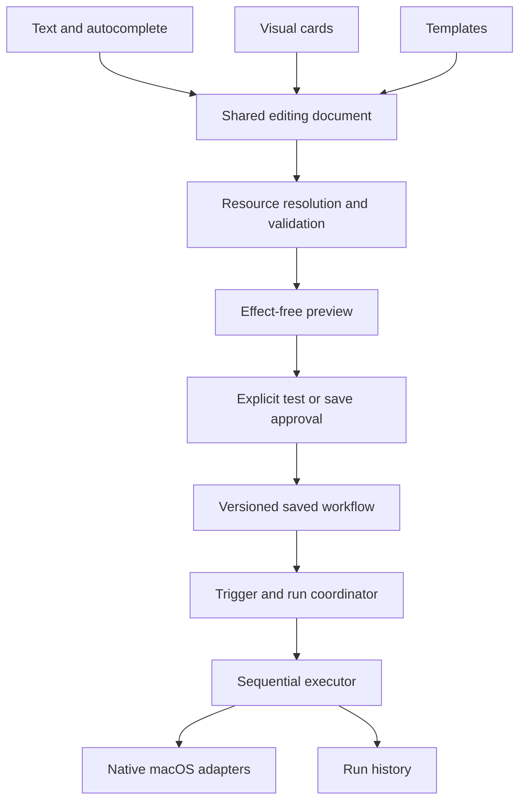

# TaskOS v1 — Product and Development Handoff

**Product:** A native macOS automation app with autocomplete-guided creation.  
**Platform:** macOS 14 and later, supporting Apple silicon and compatible Intel Macs.  
**Delivery:** Four phases, numbered **0–3**.  
**Status:** Proposed development contract. Every phase starts as **not started**.

This is a standalone plan for a team building TaskOS from the beginning. Existing implementation, previous phase completion, and historical architectural choices are not prerequisites or acceptance evidence.

## 1. Product definition

### 1.1 The product promise

> **Start typing what you want your Mac to do. Choose a suggestion, review the steps, and save an automation that runs locally.**

TaskOS helps ordinary Mac users automate repeated tasks without learning a programming language or constructing a complex node graph.

The central experience combines:

- A text field with immediate, relevant autocomplete suggestions.
- Editable trigger and action cards that update alongside the text.
- A clear preview of what will happen.
- Explicit controls to test, save, enable, pause, and run workflows.
- History that explains what happened and how to recover from failures.

There is **no AI in the application**: no model integration, model downloads, provider accounts, generated scripts, or AI fallback.

### 1.2 Intended users

The primary audience is people who repeatedly arrange the same apps, open the same resources, or perform the same setup steps.

| User | Recurring problem | TaskOS’s useful outcome |
|---|---|---|
| Office and remote workers | Reopening work tools each morning | A scheduled workspace setup |
| Students and researchers | Rebuilding a reading and notes layout | One shortcut opens resources and arranges windows |
| Writers and creators | Removing distractions and opening project materials | A reusable focused-work routine |
| Laptop users | Reconfiguring workspaces when connecting a monitor | A display-triggered setup |
| Users of external storage | Remembering what to do when a drive appears | A notification and selected folder opening |
| People with repetitive text | Copying the same agenda or checklist | A manual workflow places approved text on the clipboard |

The first release is not intended to replace advanced scripting tools.

### 1.3 Research-informed positioning

Event triggers, reusable workflows, keyword entry, and execution history are established patterns. Crank emphasizes system events and action history; Alfred combines keyword or hotkey entry with reusable workflows. These support the proposed direction, but do not establish which features TaskOS users will value most. Phase 0 includes direct usability validation. [Crank](https://lowtechguys.com/crank/), [Alfred Workflows](https://www.alfredapp.com/workflows/)

TaskOS’s proposed differentiator is:

> **Users discover supported automations while typing, and can always see and edit the exact workflow being created.**

### 1.4 First-release boundaries

**Include:**

- Autocomplete-guided creation.
- Complete visual editing in the same screen.
- Ordered workflows with one trigger and up to 12 actions.
- The capability catalog defined below.
- Templates, a workflow library, run history, and permission recovery.
- Local persistence and portable workflow export/import.
- Launch at login.
- Signed, notarized distribution and secure updates.

**Exclude:**

- AI, chatbots, generated code, and remote interpretation.
- Shell commands, AppleScript, arbitrary JavaScript, and third-party executable plugins.
- Running Apple Shortcuts.
- Conditions, branching, loops, variables, and workflow-to-workflow calls.
- File creation, movement, renaming, deletion, or bulk organization.
- Arbitrary clicks, keystroke injection, screen recognition, and application UI scripting.
- Reading messages, mail, browser content, or other applications’ notifications.
- Clipboard monitoring or clipboard history.
- Cloud synchronization, accounts, collaboration, payments, and license enforcement.
- A community marketplace.

These are scope decisions for this release, not promises for a later version.

---

## 2. Product and engineering contract

### 2.1 The main creation experience

The app opens to a **Create** screen containing the command field, suggestions, and workflow cards.

Example:

```text
Create automation

[ Every weekday at 9 am open Safari and Notes, then ... ]

Suggestions
  Put Safari on the left half
  Put Notes on the right half
  Open a website
  Show a notification

WHEN
  Every weekday at 9:00 AM
  Time zone: Follow this Mac

DO
  1. Open Safari
  2. Open Notes

  + Add action

                                  Review workflow
```

A user can:

1. Type a complete supported command.
2. Build a command by accepting suggestions.
3. Select a template and fill its missing parameters.
4. Use the visual controls without typing.

All four routes produce the same structured workflow and use the same validation and execution pipeline.

### 2.2 Autocomplete behavior

Autocomplete is a deterministic search and completion system over capabilities, grammar rules, templates, and locally available resource names.

It must not attempt to understand arbitrary requests.

#### Suggestions change with context

| User input | Example suggestions |
|---|---|
| Empty field | Start a workspace; Schedule a routine; When I connect a display |
| `open` | Open an application; Open a website; Open a selected file or folder |
| `open Sa` | Safari and other matching installed applications |
| `every` | Every day at…; Every weekday at…; Every Monday at… |
| `when I connect` | A display; External power |
| `then put Safari` | On the left half; On the right half; Maximized; On a selected display |
| `show a notification` | Title field and message field |
| `when battery drops below` | A percentage control |

Suggestions must distinguish complete commands from commands that still need parameters.

#### Ranking

Use a documented, stable ranking order:

1. Suggestions valid at the current grammar position.
2. Exact phrase and resource-name matches.
3. Prefix matches.
4. Explicitly maintained aliases.
5. Typo-tolerant discovery results.

Use stable alphabetical ordering to break equivalent matches.

Typo tolerance may help users find an option. It must not silently select a different application, resource, trigger, or action.

Limit the visible list to eight suggestions. Provide a separate “Browse all actions” route for discovery.

#### Keyboard and accessibility

- Up and Down move through suggestions.
- Enter accepts the highlighted suggestion.
- Escape dismisses suggestions without deleting the command.
- Tab retains normal focus navigation, except while the completion panel is visible with a suggestion explicitly selected, where Tab accepts that suggestion (work package 2.7; see `WP-2.7.md` §7.2).
- Accepting a suggestion never runs an automation.
- Losing focus never commits an unselected suggestion.
- Native text selection, undo, paste, and input-method composition continue to work.
- VoiceOver announces the suggestion, its category, and whether more input is required.

The interaction should follow familiar editable-combobox conventions, implemented with native macOS accessibility APIs rather than web ARIA attributes. [W3C Combobox Pattern](https://www.w3.org/WAI/ARIA/apg/patterns/combobox/)

#### Performance targets

On the declared baseline test machines:

- Warm suggestion results appear within **100 ms at p95**.
- Typing remains responsive while application discovery refreshes.
- Stale asynchronous results cannot replace results for newer input.
- No network request is required to produce suggestions.
- Permission prompts never appear merely because a user types.

### 2.3 Text and cards share one editing state

Maintain one editing document containing:

- The current command text.
- Parsed clauses and their source ranges.
- Structured trigger and action selections.
- Unresolved parameters and unmatched text.
- Stable identifiers for the visible cards.

Cards are projections of this document, not a second independently editable copy of the workflow.

When the user changes a card, update only its corresponding command clause using a canonical phrase. Preserve other clauses and unresolved text.

When the user changes text, update the affected cards and invalidate any resource selection whose meaning changed.

If a text edit makes a card-to-clause mapping ambiguous, retain the text and ask the user to resolve the ambiguity. Do not regenerate the whole command and accidentally remove part of the request.

Undo and redo must work across suggestion acceptance, text changes, card edits, insertion, deletion, and reordering.

### 2.4 Recognition and failure behavior

The parser has four outcomes:

| Outcome | Meaning | UI response |
|---|---|---|
| Complete | Every meaningful clause matches supported syntax | Resolve resources and validate the workflow |
| Needs input | A supported instruction lacks a parameter or has ambiguity | Show the relevant picker or clarification |
| Unrecognized | The wording does not match supported syntax | Highlight the span and suggest supported wording |
| Unsupported | The request names a known excluded capability | Explain the limitation and retain the request for editing |

A complete parse does not imply execution permission or successful resource resolution.

For example:

```text
Open Safari and email my manager that I am available.
```

TaskOS may recognize “Open Safari,” but must not create or save an executable workflow that omits the email instruction.

The recognized portion can remain visible as a draft. The unresolved portion must remain visible, and execution stays blocked until the user explicitly changes or removes it.

Other required behavior:

- No trigger supplied means a visibly selected **Manual** trigger.
- A bare ambiguous time such as `9` requires clarification.
- Application names that match multiple installations require selection.
- A website name must not silently become an application, or vice versa.
- Text naming a file does not grant access to that file.
- Unsupported extra clauses block completion even when earlier clauses are valid.
- Grammar updates never reinterpret an already saved workflow.

### 2.5 Initial capability catalog

The release catalog contains **nine trigger families and ten action families**.

Parameters, aliases, templates, and window presets do not count as additional families. Shipping a useful, qualified catalog takes priority over reaching an arbitrary feature count.

#### Triggers

| ID | Trigger family | Required behavior |
|---|---|---|
| T1 | Manual | Run from the app or menu bar |
| T2 | Global hotkey | A user-recorded shortcut starts one workflow |
| T3 | Schedule | One-time date/time; daily or selected weekdays; fixed intervals from 15 minutes to 24 hours |
| T4 | Application lifecycle | A selected regular GUI application launches or quits |
| T5 | Mac wakes | Fire after a genuine wake event, subject to session readiness |
| T6 | Display connection | A selected display, or any external display, connects or disconnects |
| T7 | External volume | A selected external storage volume mounts or unmounts |
| T8 | Power source | The Mac changes between external power and battery power |
| T9 | Battery threshold | Built-in battery crosses above or below a selected percentage |

Important distinctions:

- An external volume mounting is not a general USB-device connection.
- An application quitting is not a meeting ending or a document closing.
- External power availability is not a guarantee that the battery is charging.
- A display reconnecting is not a window-layout change.
- Hardware-specific triggers remain discoverable with an explanation when the current Mac lacks the hardware.

Use native workspace notifications for applicable application, wake, and volume events. Use the APIs available on macOS 14, rather than adopting newer notification interfaces without availability checks. [Apple NSWorkspace](https://developer.apple.com/documentation/appkit/nsworkspace)

Power-source notifications provide a public foundation for power and battery observation. Their behavior still requires physical qualification on a MacBook. [Apple IOPSNotificationCreateRunLoopSource](https://developer.apple.com/documentation/iokit/1523868-iopsnotificationcreaterunloopsou)

#### Actions

| ID | Action family | Required behavior |
|---|---|---|
| A1 | Open application | Launch the selected app if necessary, then activate it |
| A2 | Hide application | Hide a selected running app |
| A3 | Quit application | Request a normal quit; never force quit |
| A4 | Open website | Open an absolute HTTP(S) URL in the default browser or a selected browser |
| A5 | Open file or folder | Open an explicitly selected document or folder |
| A6 | Reveal in Finder | Reveal an explicitly selected item |
| A7 | Arrange window | Position the selected app’s eligible window using a preset and display selection |
| A8 | Wait | Pause for an explicit duration between 0.1 and 30 seconds |
| A9 | Show notification | Submit a notification with a user-configured title and message |
| A10 | Copy text | Replace the clipboard with user-configured literal text |

Window presets:

- Left and right halves.
- Top and bottom halves.
- Four quarters.
- Maximize within the usable display area.
- Center without changing size.

Display selection:

- The window’s current display.
- The main display.
- A specifically selected display.

Custom coordinates, arbitrary percentages, full-screen switching, and moving windows between Spaces are deferred.

Action-specific safeguards:

- Normal quit may be refused or delayed by an unsaved-document prompt. Report this; never dismiss the prompt automatically.
- TaskOS cannot quit itself, Finder, or system infrastructure through a workflow.
- Open-file actions reject executable applications, installers, scripts, and automation files.
- Notification success means macOS accepted the request, not that the user saw it.
- Copy-text actions clearly state that they replace clipboard contents.
- Missing resources do not cause substitution with a different app, file, or display.

### 2.6 Templates

Ship twelve curated templates:

1. Start my workday.
2. Open my study workspace.
3. Research with browser and notes side by side.
4. Open a writing workspace and hide distractions.
5. Open meeting materials.
6. Start a weekday routine.
7. Show a recurring break reminder.
8. Arrange my external-display workspace.
9. Return my workspace to the main display.
10. Open a folder when my external drive mounts.
11. Notify me at a battery threshold.
12. Copy my meeting agenda or checklist.

Templates are prefilled structured drafts.

They must:

- Use only registered capabilities.
- Explain their trigger and actions before activation.
- Ask for missing applications, files, displays, and text.
- Avoid assuming that third-party apps are installed.
- Enter the same editor, preview, and validation path.
- Remain editable after selection.

“Hide distractions” must not claim to change macOS Focus settings. “Open meeting materials” must not claim to detect or join a meeting.

### 2.7 Screens and lifecycle

Use a single main application window with five primary destinations.

| Destination | Essential behavior |
|---|---|
| Create / Edit | Command field, suggestions, cards, resource selection, undo, local draft recovery |
| Automations | Search, run, enable/disable, duplicate, rename, edit, export, delete |
| Templates | Searchable curated examples with required parameters |
| History | Workflow and action outcomes, timestamps, duration, cancellation, skipped events, recovery guidance |
| Settings | Permissions, launch at login, global shortcut, updates, privacy and local-data controls |

The workflow preview is a review state within Create/Edit, rather than another independent editor.

The menu bar provides:

- Open TaskOS.
- Run a saved workflow.
- View the current run.
- Pause or resume automatic triggers.
- Cancel the current run and clear queued runs.
- Quit TaskOS.

Closing the main window leaves the menu-bar runtime active. Quitting TaskOS stops its runtime.

Launch at login is optional and uses `SMAppService.mainApp`. It does not require a custom privileged daemon. [Apple SMAppService](https://developer.apple.com/documentation/servicemanagement/smappservice)

### 2.8 Preview, execution, and approval

The preview shows:

- Trigger and timing.
- Ordered actions and exact selected targets.
- Required permissions.
- Missing resources or unavailable hardware.
- Meaningful limitations, such as a possible unsaved-document prompt.
- Whether the workflow will run automatically after saving.

Controls:

- **Test now:** Runs the current reviewed draft once.
- **Save:** Stores the workflow without running it.
- **Enable automatic runs:** An explicit selection for event and schedule triggers.
- **Run now:** Executes a saved workflow without changing its trigger.

Testing is real execution, not a simulation. The button description must make that clear.

Previewing itself has no external effects and does not request permissions.

An edit invalidates the previous preview and test association. Execution approval is tied to the exact workflow revision being reviewed.

After a user enables a saved workflow, subsequent matching events may run that approved revision without asking again. Background execution cannot trigger new permission prompts.

### 2.9 Runtime rules

#### Sequential execution

Run one workflow at a time in v1, with its actions executed in order.

Stop on the first failed action. Mark later actions as not executed.

Do not attempt automatic rollback: launching an app, opening a URL, or replacing clipboard text may already have taken effect.

#### Queue and repeated events

- Allow at most ten queued runs.
- Allow at most one pending automatic run per workflow.
- Expire a queued automatic event after 30 seconds rather than executing stale work.
- Record queue overflow, expiration, and duplicate suppression.
- Apply a ten-second cooldown to automatic event triggers.
- Suppress hotkey key-repeat; one deliberate press produces one request.
- Pausing automatic triggers clears pending automatic runs but allows the current run to finish.
- The separate cancel control stops the current run and clears the queue.

#### Feedback loops

Workflows cannot invoke other workflows.

Reject obvious self-triggering configurations, such as a quit-triggered workflow that opens and quits its triggering app.

Track app lifecycle changes initiated by TaskOS. Suppress correlated lifecycle triggers for those app identities during the operation and its bounded settling period. Treat this as conservative suppression, not perfect attribution of every OS event.

Use the queue limit and cooldown as additional defenses against repeated event chains.

#### Timeouts and cancellation

Initial defaults:

| Operation | Deadline |
|---|---:|
| App open or activation | 15 seconds |
| Normal quit | 15 seconds |
| Window discovery and arrangement | 10 seconds |
| URL, file, or Finder request | 10 seconds |
| Notification or clipboard operation | 5 seconds |
| Entire workflow | 180 seconds |

Limit cumulative explicit waits to 60 seconds per workflow.

Cancellation must prevent the next action from starting. A platform request already delivered may still complete; history must describe that possibility accurately.

Do not equate cancellation of a Swift task with cancellation of an underlying synchronous macOS call. Platform adapters require bounded calls and late-result handling.

#### Scheduling

- Recurring wall-clock schedules follow the Mac’s current time zone.
- Show the next three occurrences in the editor.
- A nonexistent daylight-saving local time is skipped.
- A repeated local time executes once, using the first occurrence.
- Missed occurrences while TaskOS is closed or the Mac is asleep are skipped.
- Interval schedules skip missed intervals rather than replaying a backlog.
- Relative one-time input is converted to a visible absolute date/time for review.
- A one-time schedule that becomes past-due before saving requires correction.

TaskOS does not wake the computer or promise execution while it is shut down.

#### Device state

- Initial observation establishes a baseline; it is not itself a connection or threshold event.
- Display and volume callbacks are reconciled into actual additions and removals.
- Battery triggers fire on crossings, not on every battery update.
- Battery rearming uses a two-percentage-point margin to prevent repeated firing near the threshold.
- Unknown battery data produces an unavailable state, not a fabricated percentage.
- A specifically selected unavailable display does not silently fall back to another display.
- Sleep or an inactive user session prevents new cross-app effects. A run interrupted by sleep stops instead of resuming unexpectedly after wake.

### 2.10 Technical architecture

Use Swift 6 with SwiftUI and focused AppKit integration. Keep the deployment target at macOS 14.



#### Layers

| Layer | Responsibility |
|---|---|
| Core | Typed definitions, registry, grammar, validation, schedule calculations, execution policies |
| Application | Editing state, preparation, approval, persistence coordination, trigger reconciliation |
| Platform | AppKit, Accessibility, power, display, file-reference, notification, clipboard and hotkey adapters |
| Presentation | SwiftUI screens, native text input, cards, accessibility, error presentation |

Core cannot import SwiftUI, AppKit, SwiftData, or concrete platform adapters.

Use:

- `@MainActor` for presentation state and APIs requiring main-thread access.
- Actors for the execution coordinator, scheduling state, and shared mutable runtime state.
- Injectable clocks, resource catalogs, event sources, and executors.
- One production composition root.
- A separate pure-Core test target or Swift package for fast deterministic checks.

#### Important types and interfaces

| Contract | Required responsibility |
|---|---|
| `CapabilityRegistry` | Stable IDs, typed parameters, labels, aliases, grammar references, permission metadata, availability rules, and implemented adapter bindings |
| `ComposerDocument` | Command text, source ranges, editable clauses, selected resources, unresolved spans, and revision |
| `SuggestionEngine` | Contextual ranked suggestions without external effects |
| `CommandParser` | Full-input recognition and structured diagnostics |
| `AutomationDraft` | Incomplete or complete typed authoring data; no execution authority |
| `AutomationDefinition` | Versioned, resolved, saved trigger and ordered actions |
| `CreationPreparer` | Resource resolution, validation, read-only preflight, and preview production |
| `RunCoordinator` | Admission, pause state, queueing, deduplication, and revision selection |
| `ActionExecutor` | One supported native effect and its bounded result |
| `TriggerSource` | Typed observations with registration identity and cancellation |
| `AutomationRepository` | Persistence and migrations behind an interface |
| `RunRecord` | Operational outcomes and recovery information |

Registry entries cannot introduce executable behavior by themselves. Adding a capability requires a typed implementation and complete test coverage.

Do not build a dynamic plugin system or a generic form-description language for v1.

#### Text implementation

Use a tokenizer and explicit grammar with source spans. RegexBuilder may recognize bounded tokens such as durations, percentages, and supported schedule phrases.

Do not use independent keyword searches to assemble a workflow.

Use the same rule definitions to support parsing, canonical phrase generation, and completion discovery. The grammar is English-only for v1; resource names and literal content retain Unicode support.

#### Platform implementations

- App and resource opening: `NSWorkspace`.
- App hide and normal quit: `NSRunningApplication`.
- Window control: Accessibility APIs.
- Display identity and geometry: AppKit/CoreGraphics.
- Power observation: IOKit power-source APIs.
- Notifications: UserNotifications.
- Clipboard writing: `NSPasteboard`.
- Login behavior: ServiceManagement.
- Hotkeys: KeyboardShortcuts behind an adapter.
- Updates: Sparkle 2 behind an update coordinator.

KeyboardShortcuts provides native shortcut recording and conflict warnings. Pin a compatible release and retain actual registration-failure handling; warnings cannot guarantee that every third-party shortcut conflict is detectable. [KeyboardShortcuts](https://github.com/sindresorhus/KeyboardShortcuts)

#### Window targeting

For the selected app:

1. Prefer its standard main window.
2. Otherwise use its standard focused window.
3. Otherwise use the only eligible standard window.
4. If multiple windows remain ambiguous, fail clearly.

Do not choose an arbitrary first window.

Wait for window availability within the deadline. Check whether required attributes are settable, respect the usable screen area, and verify the resulting geometry.

Permission and capability checks must precede Accessibility operations. [Apple Accessibility APIs](https://developer.apple.com/documentation/applicationservices/1460720-axisprocesstrusted)

### 2.11 Persistence and privacy

Use SwiftData behind the repository interface.

Persist:

- Workflow identity, name, enabled intent, revision, and versioned definition.
- Explicitly selected resource references.
- Current local draft state for recovery.
- Run and action outcomes.
- User settings.

Rules:

- A saved workflow executes its structured definition; it is never reparsed.
- Draft autosave retains only the current draft, not typing history.
- Cancel deletes the corresponding draft.
- Saving atomically updates the definition and removes its draft.
- Editing a workflow creates a new revision; an active run retains its original immutable revision.
- Startup marks unfinished prior runs as interrupted and does not replay them.
- A migration failure preserves the original store and offers recovery; it never silently resets user data.
- Unknown future schemas or capabilities remain visibly unsupported rather than being partially loaded.

Resource selection is application-enforced:

- Resolve files through explicit user selection and durable references.
- Do not crawl the user’s disk to guess which file they meant.
- Do not treat a typed path or imported bookmark as fresh authorization.
- Do not assume bookmarks bypass macOS permissions.

History retention defaults to 30 days or 1,000 runs, whichever limit is reached first.

History and exported diagnostics contain operational metadata, not command text, clipboard content, complete URLs, file contents, bookmark bytes, or raw platform errors that expose such values.

Creation and execution work offline. Update checks are a separate, disclosed network feature. Opening a website can cause the selected browser to access the network; the product must not describe that as an entirely network-free operation.

No analytics SDK or automatic diagnostic upload is included.

### 2.12 Portable workflows

Provide file-based export/import for user backup and transfer.

Export includes:

- Format version.
- Workflow name.
- Trigger and action configuration.
- Human-readable resource labels requiring rebinding.
- Literal content needed by the workflow.

Export excludes:

- Local bookmark authority.
- Run history.
- Current draft text.
- Permission state.
- Enabled state.

Before export, explain that configured URLs, notification messages, and copied text may contain private information.

Imports:

- Are limited to 256 KiB per workflow.
- Reject unknown executable fields and unsupported schemas.
- Receive fresh local identities.
- Start disabled.
- Require explicit local resource selection and review.
- Never run automatically after import.

---

## 3. Delivery phases

The four phases are release checkpoints. Their numbered work packages are bounded implementation tasks, not additional major phases.

Every task must identify its behavior, dependencies, acceptance criteria, focused tests, and required physical evidence.

### Phase 0 — Validate the experience and establish the foundation

**Objective:** Prove that the proposed experience is understandable and that the platform can support the promised catalog before committing to the full build.

**Estimated effort:** 8–12 engineering days, plus design and participant time.

#### 0.1 — Establish the product contract

**Deliver:**

- The feature catalog and exclusions above.
- The twelve template specifications.
- Initial command grammar and examples.
- Screen flows for creation, editing, preview, permission recovery, and history.
- A capability ledger mapping each family to its API, parameters, permissions, hardware requirements, and acceptance evidence.

**Acceptance:**

- Every template maps entirely to supported capabilities.
- No advertised workflow depends on an excluded feature.
- User-facing terminology distinguishes app events, volume events, power state, and actual task completion.

#### 0.2 — Validate autocomplete with users

Build a small interactive prototype of the command field, suggestions, and cards.

Test with at least five representative users on:

1. Creating a two-app workspace.
2. Scheduling that workspace.
3. Correcting an incomplete time or application reference.
4. Handling an unsupported request.
5. Editing an action through its card.

**Acceptance:**

- At least four of five users create the basic workspace without facilitator intervention.
- Users can explain what selecting a suggestion does.
- No participant believes suggestion acceptance immediately executes actions.
- Unsupported wording remains understandable and recoverable.
- Record task completion, errors, confusion, and time; revise the design where it fails.

The prototype is design evidence, not production implementation credit.

#### 0.3 — Qualify platform risks

Build narrow characterization spikes for:

- Launching apps and finding their windows.
- Arranging windows on one and two displays.
- Accessibility denial, grant, and revocation.
- Normal quit with unsaved content.
- Global hotkey registration and conflict behavior.
- App, wake, display, and volume events.
- External power changes and battery readings.
- Selected-file persistence after relaunch.

Use an Apple silicon Mac, an Intel Mac supporting macOS 14, a MacBook, an external display, and removable storage.

**Acceptance:**

- Each required capability has a documented public API path.
- Required permissions are identified through observation.
- No feature requires a private API, generated script, or privileged helper.
- Unsupported application/window behavior is characterized honestly.
- A blocked required family is resolved before dependent implementation proceeds.

#### 0.4 — Establish the production skeleton

Create:

- Native application and menu-bar shell.
- Core module and layer boundaries.
- Debug and Release configurations.
- macOS 14 deployment target and universal build settings.
- Deterministic test infrastructure with fake clocks and platform adapters.
- CI build/test jobs.
- Dependency lockfiles and a pinned supported toolchain.
- Initial versioned persistence envelope.

**Acceptance:**

- A clean checkout builds in Debug and Release.
- Core tests execute without launching or controlling other applications.
- Main-window closure and application quit have distinct, tested behavior.
- No AI SDK, provider configuration, or AI-specific networking exists.

#### 0.5 — Establish distribution access early

Confirm:

- Product bundle identity.
- Developer ID signing access.
- Secure ownership of signing and update keys.
- Update hosting location.
- Physical compatibility test machines.
- Support and issue-reporting ownership.

Produce and install a signed, notarized minimal app.

**Phase 0 exit gate:**

The team has a validated interaction design, qualified platform foundations, a buildable project, and a proven signing path. All required capabilities have feasible implementations; none rely on unverified claims.

---

### Phase 1 — Deliver the first complete automation experience

**Objective:** A user can type, complete, review, test, save, edit, relaunch, and run a useful workspace automation.

**Estimated effort:** 25–35 engineering days.

#### 1.1 — Build the typed domain and registry

Implement:

- Trigger and action definitions.
- Stable capability IDs.
- Typed resource references.
- Parameter validation.
- Workflow revisions.
- Registry consistency checks.
- Initial persistence and migration scaffolding.

Start with Manual, Open Application, Open Website, Arrange Window, Wait, and Show Notification.

**Acceptance:**

- Unknown capabilities and invalid parameters cannot reach execution.
- Registry entries cannot exist without typed implementations.
- Saved encoding round-trips without losing ordering or parameters.
- Core remains independent of presentation and platform frameworks.

#### 1.2 — Build the shared composer

Implement:

- Native text editing.
- Grammar and source spans for the initial catalog.
- Contextual suggestions.
- Live trigger/action cards.
- Resource selection.
- Add, remove, and reorder.
- Undo and redo.
- Current-draft autosave.

**Acceptance:**

- Text, cards, and templates produce equivalent resolved definitions.
- An unknown suffix blocks completion of an otherwise valid command.
- Card editing preserves unrelated and unresolved text.
- Stale suggestions and stale resource resolutions cannot overwrite newer edits.
- Keyboard and VoiceOver operation work from the beginning.

#### 1.3 — Build preparation, preview, and execution

Implement:

- Resource resolution.
- Effect-free preflight.
- Preview bound to a draft revision.
- Permission requests initiated by user actions.
- Sequential execution.
- Timeouts, cancellation, and explicit partial results.
- Local run history.

**Acceptance:**

- Preview launches nothing and changes no window.
- Test runs only after explicit user action.
- Modifying a draft invalidates prior approval.
- Failure stops subsequent actions.
- Cancellation does not allow a later action to begin.

#### 1.4 — Prove the first complete workflow

Use this canonical scenario:

```text
Manually open Safari and Notes.
Open a selected website in Safari.
Put Safari on the left half.
Put Notes on the right half.
```

Exercise:

1. Creation through autocomplete.
2. Creation through cards.
3. Preview.
4. Accessibility explanation and permission recovery.
5. Test.
6. Save.
7. Run from the library.
8. Edit an application or layout.
9. Inspect history.
10. Quit and relaunch.
11. Run the restored definition.

**Acceptance:**

- The entire path works in a Release build on a physical Mac.
- Saved execution does not invoke the parser.
- Required application and window behavior is verified, not inferred from mocks.
- Missing permission, unavailable application, and ambiguous window cases produce useful recovery instructions.

This is the first milestone used to reforecast the remaining schedule.

#### 1.5 — Complete the basic product shell

Implement:

- Workflow library.
- Search, rename, duplicate, edit, delete, and run.
- Menu-bar access.
- Global hotkey recording.
- Basic onboarding.
- Settings and permission status.
- Interrupted-run recovery.

Duplicating creates a new identity and starts with automatic execution disabled.

**Phase 1 exit gate:**

A new user can complete the canonical workspace journey using autocomplete or cards, recover from common errors, and run the saved workflow after relaunch. The result is a usable application, not an isolated engine demonstration.

---

### Phase 2 — Complete everyday workflows and automatic execution

**Objective:** Deliver the full catalog, templates, scheduling, device events, and daily management experience.

**Estimated effort:** 30–45 engineering days.

Implement in the following order.

#### 2.1 — Add scheduling and runtime admission

Implement:

- One-time, weekday, daily, and interval schedules.
- Next-occurrence preview.
- Time-zone and daylight-saving policies.
- Queue limits and expiration.
- Automatic-run enablement.
- Pause/resume and cancellation.
- Launch at login.
- Sleep and session-readiness handling.

**Acceptance:**

- Enabling a schedule does not create an immediate unintended run.
- Missed schedules are not replayed.
- Repeated local times do not produce duplicate runs.
- Pause, disable, edit, and delete cancel obsolete registrations.
- Runtime restoration cannot deliver events before stored definitions are validated.

#### 2.2 — Finish app, window, and utility actions

Add:

- Hide application.
- Normal quit.
- All declared window presets and display selectors.
- Literal clipboard text.
- Complete notification editing and permission handling.

Extend grammar, suggestions, cards, validation, and history for each addition.

**Acceptance:**

- Every action is available through both text and cards.
- Window targets and actual geometry are checked.
- Unsupported full-screen or ambiguous window situations fail clearly.
- Normal quit never becomes force quit.
- Clipboard contents are not read or captured.
- Workflow loops involving app lifecycle changes are constrained.

#### 2.3 — Add selected files and portable workflows

Implement:

- File/folder selection.
- Open and reveal actions.
- Durable resource references.
- Missing-resource repair.
- Export/import with rebinding and disabled defaults.

**Acceptance:**

- Typing or importing a path does not bypass selection requirements.
- Missing or inaccessible files produce recovery instructions.
- Executable and unsupported file types are rejected.
- Imported workflows cannot execute before review.
- Export/import retains supported semantics and action order.

#### 2.4 — Add event-triggered workflows

Implement:

- App launch and quit.
- Wake.
- Display connection and disconnection.
- External-volume mount and unmount.
- Power-source transitions.
- Battery threshold crossings.

Each trigger requires its complete vertical implementation:

> Event source → typed configuration → suggestions → cards → validation → persistence → registration → execution → history → physical evidence.

**Acceptance:**

- Registration establishes a baseline without fabricating an event.
- Display and volume bursts produce the intended logical transition.
- Battery jitter does not repeatedly trigger an alert.
- Absent hardware is represented accurately.
- Callback delivery from an obsolete registration cannot start a run.
- Background permission failure produces an attention state, not a prompt loop.

#### 2.5 — Finish the template and discovery experience

Deliver all twelve templates and searchable capability discovery.

For every capability, show:

- What it does.
- A supported command example.
- Required parameters.
- Permissions.
- Relevant limitations.
- Availability on the current Mac.

**Acceptance:**

- Every template completes through the same editor.
- Search does not advertise unimplemented behavior.
- Users can discover supported alternatives after an unrecognized request.
- A missing resource is resolved with a targeted control rather than requiring the user to restart creation.

#### 2.6 — Complete everyday management and recovery

Implement:

- Clear enabled, paused, unavailable, and attention-needed states.
- Action-level history.
- Queue and skipped-event visibility.
- Permission recheck and resource repair.
- Draft recovery.
- Data retention and clearing.
- Refined onboarding and help examples.

**Phase 2 exit gate:**

Every advertised capability works through creation, editing, persistence, and its real execution path. The full template library works on the applicable hardware. Negative and mixed requests fail closed. The feature catalog is frozen for release qualification.

---

### Work Package 2.7 — Deterministic language hardening (pre-Phase 3)

**Status:** not started. **Contract:** `WP-2.7.md`.

Before broad Phase 3 qualification begins, harden the deterministic creation
path so TaskOS understands more safe commands without adding a compiler,
workflow engine, store, runtime, or capability family. The authoritative path
stays:

> Command text → parser → composer document → trusted resource resolution →
> typed automation definition → preparation → preview and approval → existing
> runner.

Scope rules: no AI, semantic matching, speech, or wake words; no network
dependency; no shell, AppleScript, JavaScript, or plugins; no conditions,
branches, parallel actions, or multiple-trigger workflows; saved workflows, run
history, and exports carry no command text, rationale, parser evidence, or
transcripts; recoverable drafts stay local and are removed after Save, New, or
Discard; all parsing fails closed and Preview, Save, and Test stay disabled
until syntax, trusted resources, and all required card values are complete.

Work package 2.7 intentionally corrects unsafe compatibility behavior
(bare-domain URLs, multiple triggers, unquoted Copy Text, duplicate app display
names, the `closes` alias, ignored unknown tails, arbitrary rationale, and
schedule drift). The full compatibility exception table and the exact source,
draft, time, and asynchronous-validity contracts live in `WP-2.7.md`.

This package replaces the "Tab retains normal focus navigation" rule in §2.2
only while the completion panel is visible with a suggestion explicitly
selected: Tab then accepts that suggestion (`WP-2.7.md` §7.2).

**Exit gate:** every 2.7A–2.7D gate passes; the independent language corpus
passes; saved-workflow compatibility, draft migration, privacy inspection,
Debug and Release builds, automated and UI tests, and required physical checks
pass; measured parser and completion performance meets the targets in
`WP-2.7.md` §8.3 or an owner-approved decision changes them; `PROGRESS.md`
records the full evidence. Tag `wp-2.7-language` after the package closes.
Phase 3 begins only after 2.7.

---

### Phase 3 — Qualify, beta-test, and distribute

**Objective:** Ship the frozen product with demonstrated reliability, understandable failures, and a verified installation/update path.

**Estimated effort:** 20–30 engineering days, including engineering support for beta testing.

#### 3.1 — Complete system validation

Run:

- Full deterministic suites.
- Parser and suggestion corpus.
- Text/card/template parity.
- Persistence and migration fixtures.
- Runtime interruption and event-storm tests.
- Release UI journeys.
- Architecture and final-change review.

Fix release-blocking defects without adding new capability families.

**Acceptance:**

- All required automated suites pass.
- Every executable route uses the approved pipeline.
- No input fragment is silently discarded.
- No unresolved high-severity data-loss, unintended-execution, privacy, or security issue remains.

#### 3.2 — Run the physical compatibility matrix

Cover:

- macOS 14, 15, and 26 on supported hardware combinations.
- Apple silicon and Intel.
- A laptop and a desktop.
- Single display and multiple displays.
- Different scaling arrangements and display positions.
- External storage reconnects.
- Battery and external-power transitions.
- Accessibility and notification permission denial/revocation.
- Login-item disablement.
- Sleep, wake, relaunch, and interrupted runs.
- Standard and multiple-window application behavior.

Use a declared application matrix including Safari, Notes, Finder, TextEdit, a Chromium browser, and an Electron application.

Do not imply universal compatibility with every macOS app. Publish known limitations and distinguish tested support from best-effort behavior.

#### 3.3 — Validate usability, accessibility, and performance

Run a fresh usability round with at least eight representative users.

Tasks include:

- Create an automation from an empty screen.
- Use and customize a template.
- Correct unsupported wording.
- Schedule and pause a workflow.
- Recover from missing Accessibility permission.
- Explain a partial failure from history.

**Acceptance:**

- At least seven of eight complete the basic creation-and-save task without facilitator intervention.
- No observed path accidentally runs from suggestion acceptance.
- Core creation and recovery paths are keyboard- and VoiceOver-operable.
- Suggestion latency meets its target.
- Idle operation shows no polling loop or sustained avoidable CPU use.

Initial performance budgets:

- Main window ready for interaction within two seconds on the baseline machine.
- Warm autocomplete p95 within 100 ms.
- Idle CPU below 1% averaged over 30 minutes under the defined test workload.
- Idle resident memory below 200 MB under that workload.

These are engineering targets to measure, not claims of current performance.

#### 3.4 — Conduct the beta

Run a minimum two-week beta with at least ten users after the catalog is frozen.

Collect:

- User-reported successful and failed workflows.
- Permission-recovery problems.
- Unsupported phrases users expected to work.
- Crash reports voluntarily supplied by users.
- Confusing or misleading product language.

Do not add automatic content telemetry.

Classify beta findings as:

- Release blocker.
- Required usability or reliability correction.
- Documented compatibility limitation.
- Future feature request.

Requests for new capability families do not automatically expand v1.

#### 3.5 — Finish distribution and updates

Deliver:

- Developer ID-signed application.
- Hardened Runtime configuration.
- Notarized and stapled distribution package.
- DMG installation flow.
- Sparkle update integration.
- Signed update artifacts served over HTTPS.
- Update consent and settings.
- Release notes, privacy information, known limitations, and support instructions.

Apple’s direct-distribution process requires appropriate signing and notarization; these must be tested using the actual distributed package. [Apple notarization guidance](https://developer.apple.com/documentation/security/notarizing-macos-software-before-distribution)

Sparkle provides update signing and installation mechanisms. Test a genuine older signed build upgrading to the release candidate, including interrupted downloads and invalid signatures. [Sparkle documentation](https://sparkle-project.org/documentation/)

Do not install an update while a workflow is running. Stop new admissions, finish or explicitly cancel the active run, persist state, and then allow restart.

#### 3.6 — Freeze and release

Create a release evidence package identifying:

- Exact source revision.
- Toolchain and dependency versions.
- Distributed artifact hashes.
- Supported OS and hardware matrix.
- Advertised capability catalog.
- Automated results.
- Physical validation results.
- Beta findings and their dispositions.
- Known limitations.
- Signing, notarization, installation, and update evidence.

**Phase 3 exit gate:**

The packaged application installs and updates correctly, the frozen catalog passes its acceptance matrix, user testing supports the creation experience, and no release-blocking issue remains.

---

## 4. Validation and team execution

### 4.1 Required test scenarios

| Area | Mandatory scenarios |
|---|---|
| Autocomplete | Empty input, partial words, aliases, typo suggestions, cursor edits, stale results, paste, Unicode, input methods |
| Parsing | Complete commands, missing values, ambiguous values, unsupported clauses, valid prefix plus invalid suffix, repeated connectors |
| Editing | Text/card synchronization, reorder, undo/redo, resource invalidation, draft recovery |
| Validation | Missing trigger/action parameters, invalid URL, unsupported file, excessive waits, unavailable capability |
| Approval | Revision changes, stale preview, preview with no effects, explicit test, enabled saved execution |
| Execution | Ordered success, first failure, timeout, cancellation, late platform response, queue overflow, event suppression |
| Scheduling | Time-zone change, daylight-saving gaps/repeats, sleep, restart, missed intervals, past-due one-time runs |
| Hardware | Display churn, drive reconnect, power transition, threshold jitter, unavailable readings |
| Persistence | Relaunch, schema upgrade, corrupt record, interrupted write, active-run recovery, imported future version |
| Privacy | No command or resource payloads in diagnostics; no network dependency for creation; no clipboard reads |
| Distribution | Clean installation, revoked permission recovery, old-to-new update, invalid update signature, interrupted download |

Maintain a reviewed language corpus containing:

- Every advertised grammar production.
- Multiple accepted phrasings for each capability.
- Incomplete and ambiguous examples for every parameter category.
- At least 100 mixed or negative cases designed to catch partial interpretation.
- Editing sequences that change previously resolved meaning.

All unsupported and mixed-input safety cases must pass. Average accuracy cannot excuse an input that silently creates the wrong workflow.

### 4.2 Evidence classes remain separate

Report these separately:

1. Deterministic tests.
2. Builds and static/source checks.
3. Automated UI tests.
4. Physical macOS and hardware validation.
5. User usability and beta evidence.
6. Distributed-package and update evidence.

A green unit suite does not prove that macOS moved a real window or delivered a hardware event.

### 4.3 Reliability acceptance

For the frozen release matrix:

- Run each advertised capability repeatedly on its applicable configurations.
- Exercise the core workspace workflows at least 20 times per declared baseline configuration.
- Record attempt counts, actual outcomes, expected refusals, and failures.
- Require at least 95% complete-workflow success in valid, supported scenarios.
- Require zero unintended executions, wrong-target effects, or silent partial interpretations.
- Treat denial and unavailable-resource tests as successful only when they stop safely and explain the problem.

Do not describe a small test sample as proof of a population-wide reliability percentage.

### 4.4 Efficient implementation procedure

For each bounded work package:

1. Read its contract and directly affected modules.
2. Implement one complete user-visible behavior.
3. Run focused tests and the relevant platform smoke check.
4. Review the change and update the acceptance record.
5. Pass a compact handoff to the next task.

A handoff contains:

- Behavior delivered.
- Interfaces changed.
- Tests and physical checks actually performed.
- Remaining defects or evidence gaps.
- The next eligible work package.

Run comprehensive gates at phase boundaries, not after every small edit. Repeat previous checks only when new changes invalidate their evidence.

A capability is not complete because its adapter exists. Its text route, card controls, failure presentation, persistence, and required physical evidence must also be complete.

### 4.5 Suggested team and effort

| Phase | Engineering effort |
|---|---:|
| Phase 0 | 8–12 days |
| Phase 1 | 25–35 days |
| Phase 2 | 30–45 days |
| Phase 3 | 20–30 days |
| **Total** | **83–122 engineering days** |

Suggested staffing:

- Two macOS engineers.
- A product designer during Phase 0 and the composer work.
- Part-time QA throughout, increasing during Phase 3.
- A product owner responsible for scope, user testing, and release decisions.

A provisional schedule is **10–16 calendar weeks with two experienced engineers and overlapping design/QA**, or approximately **17–25 engineering weeks for one engineer**, before accounting for external delays.

These are planning estimates, not measurements. Reforecast after Phase 0 qualification and again after the first complete Phase 1 workflow.

---

## 5. Assumptions and final acceptance

### Confirmed choices

- Autocomplete primarily creates reusable automations.
- Text and live cards share one creation screen.
- V1 focuses on everyday workflows.
- Minimum supported OS is macOS 14.
- Payments and licensing are deferred.
- The application contains no AI functionality.

### Defaults selected for this plan

- English command grammar and initial interface.
- Native direct distribution.
- Apple silicon and compatible Intel support.
- One trigger and up to 12 ordered actions.
- One workflow executing at a time.
- No automatic retries of failed workflows.
- No automatic catch-up of missed schedules.
- Local-only workflow storage and draft recovery.
- File-based portability; no cloud synchronization.
- Hardware capability availability is explicit.
- All four phases require their own acceptance evidence.
- Existing work receives no automatic completion credit.

### The release is complete when

A new user can install TaskOS, begin typing an everyday automation, select useful suggestions, understand the resulting cards, resolve missing details, review the exact steps, test them deliberately, save and enable the workflow, and trust its later runs to behave the same way.

When the request is unsupported, a permission is missing, or an external application behaves differently, TaskOS must stop predictably and explain the next useful action.

